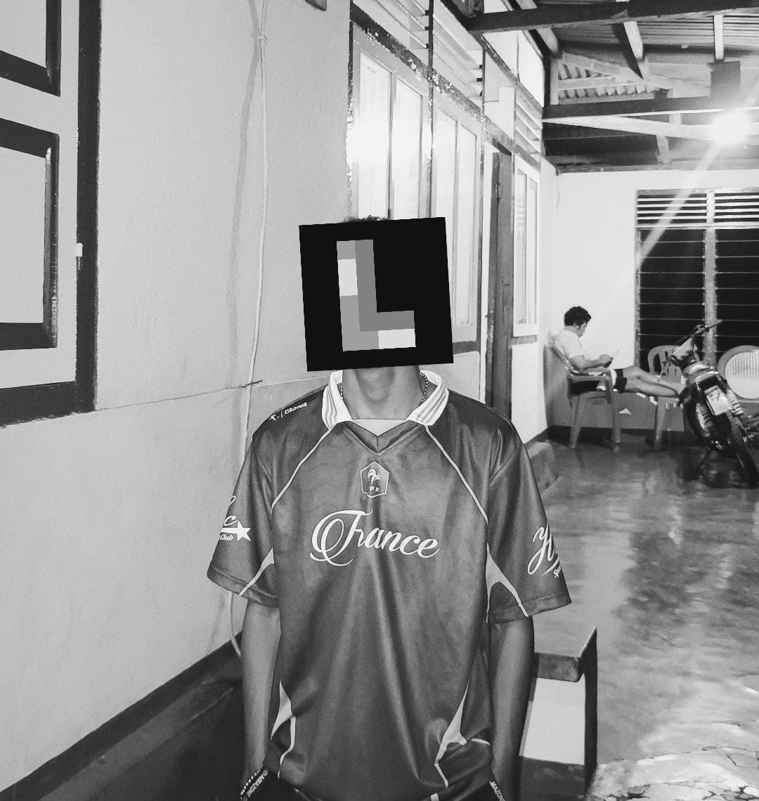
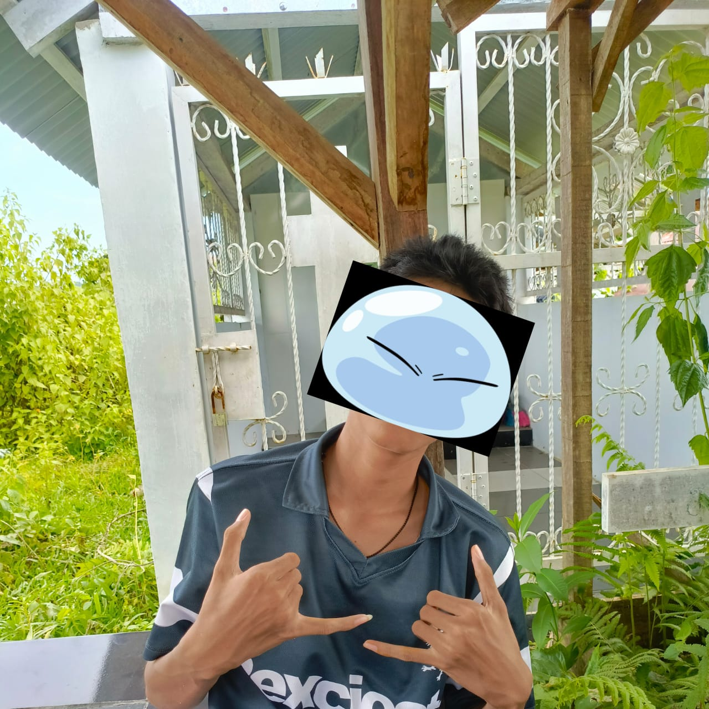

<div align="center">

# Rupiah's Hunters

**Bukan grup instan. Tempat belajar bisnis, cari lowongan, dan bertumbuh bersama — dari niat, jadi nyata.**

<br>

[](https://ikyletwar.github.io/rupiahs-hunters/)
[](https://github.com/Ikyletwar/rupiahs-hunters)
[](./LICENSE)
[]()
[]()
[]()

<br>

**Monokrom · Glassmorphism · Premium Animations · Zero Dependencies**

<br>

[**🌐 Live Demo**](https://ikyletwar.github.io/rupiahs-hunters/) &nbsp;·&nbsp;
[**📖 Dokumentasi**](#-daftar-isi) &nbsp;·&nbsp;
[**🐛 Laporkan Bug**](https://github.com/Ikyletwar/rupiahs-hunters/issues) &nbsp;·&nbsp;
[**💬 Gabung Grup**](https://chat.whatsapp.com/JJwnH9KzwWt23Pa05dP2R0)

</div>

---

## 📑 Daftar Isi

- [Tentang Project](#-tentang-project)
  - [Visi](#-visi)
  - [Misi](#-misi)
  - [Filosofi](#-filosofi)
  - [Kenapa Website Ini Ada](#-kenapa-website-ini-ada)
- [Fitur Lengkap](#-fitur-lengkap)
  - [Desain](#-desain)
  - [Animasi & Interaksi](#-animasi--interaksi)
  - [Navigasi](#-navigasi)
  - [Performa](#-performa)
  - [Aksesibilitas](#-aksesibilitas)
  - [Responsive](#-responsive)
- [Halaman Website](#-halaman-website)
- [Struktur Project](#-struktur-project)
- [Tech Stack](#-tech-stack)
- [Getting Started](#-getting-started)
  - [Prasyarat](#-prasyarat)
  - [Instalasi](#-instalasi)
  - [Menjalankan Secara Lokal](#-menjalankan-secara-lokal)
  - [Build untuk Production](#-build-untuk-production)
- [Deployment](#-deployment)
  - [GitHub Pages](#-github-pages)
  - [Vercel](#-vercel)
  - [Netlify](#-netlify)
  - [Cloudflare Pages](#-cloudflare-pages)
- [Kustomisasi](#-kustomisasi)
- [Browser Support](#-browser-support)
- [Performance](#-performance)
- [Accessibility](#-accessibility)
- [Roadmap](#-roadmap)
- [Contributing](#-contributing)
- [Code of Conduct](#-code-of-conduct)
- [Security](#-security)
- [Changelog](#-changelog)
- [License](#-license)
- [Tim](#-tim)
- [Kontak](#-kontak)
- [Penghargaan](#-penghargaan)
- [FAQ](#-faq)

---

## 📖 Tentang Project

**Rupiah's Hunters** adalah landing page premium untuk komunitas bisnis & karier. Bukan sekadar halaman web — ini sebuah *statement*. Undangan bagi orang-orang yang bosan menunggu dan siap bergerak.

Dibangun dengan pendekatan **monokrom premium** — tanpa warna sama sekali, hanya hitam, putih, dan abu-abu yang dikurasi dengan cermat. Setiap detail, dari tipografi hingga animasi, dirancang untuk menyampaikan satu hal: **keseriusan**.

### 🎯 Visi

> Menjadi tempat berkumpulnya orang-orang yang serius bertumbuh — dalam bisnis, karier, dan relasi.

### 🚀 Misi

1. **Menyediakan ruang yang jujur** — bukan grup ramai tanpa makna, tapi komunitas kecil yang berkualitas.
2. **Menghubungkan orang yang tepat** — dari pencari kerja, pemilik usaha, sampai yang baru mulai.
3. **Menciptakan lapangan kerja** — bukan cuma cari kerja, tapi bareng-bareng bikin peluang.
4. **Bertumbuh bersama** — kalau satu naik, yang lain ikut naik.

### 💭 Filosofi

> *"Peluang tidak datang sendiri. Ia diburu — dengan niat, dengan gerak, dan dengan orang-orang yang tepat di sekitar kita."*

Kami percaya bahwa:

- **Solusi, bukan obrolan** — setiap diskusi harus punya ujungnya.
- **Bertumbuh bersama** — jika satu naik, yang lain ikut naik.
- **Dari niat, jadi nyata** — eksekusi lebih berharga dari ide.

### 🔥 Kenapa Website Ini Ada

Kami nggak bikin grup ini karena pengen jadi "founder keren". Kami bikin karena kami sendiri butuh — dan kami pikir orang lain juga.

- Pengen mulai usaha tapi nggak ada yang bisa ditanyain.
- Pengen cari kerja tapi nggak tau harus mulai dari mana.
- Punya ide tapi nggak ada yang diajak diskusi.
- Banyak grup yang ramai, tapi isinya cuma spam dan basa-basi.

**Rupiah's Hunters** hadir sebagai jawaban: satu tempat kecil, tapi serius.

---

## ✨ Fitur Lengkap

### 🎨 Desain

- **Monokrom Premium** — palet warm-tinted grayscale tanpa warna sama sekali
- **Glassmorphism** — kaca berlapis dengan border hairline, inner highlight, dan backdrop blur
- **Noise Texture** — overlay SVG subtle untuk memberi tekstur kertas pada background
- **Ambient Orbs** — bulatan blur yang mengapung pelan sebagai bahan blur untuk glass
- **Fluid Typography** — ukuran teks responsif dengan ```clamp()```
- **Multi-layer Shadows** — 4 tier (sm, md, lg, xl) untuk depth yang konsisten
- **Gradient Text** — judul pakai gradient 4-stop dari putih ke abu gelap
- **Hairline Borders** — border super tipis (opacity 0.08) yang bikin kerasa premium
- **Inner Highlights** — ```inset 0 1px 0``` di semua glass card

### 🎬 Animasi & Interaksi

- **Boot Sequence** — halaman pembuka dengan typewriter effect per karakter
- **Kinetic Typography** — huruf muncul satu per satu dengan *ink-in* blur
- **Rotating Typewriter** — teks hero berganti otomatis (ketik → hapus → ketik ulang)
- **Auto Stagger Reveal** — setiap section muncul elemen-per-elemen saat di-scroll
- **Page Enter Transition** — overlay fade-out saat halaman dibuka
- **Scroll Progress Bar** — indikator tipis di atas halaman
- **Cursor-Aware Spotlight** — radial gradient yang mengikuti kursor di card & button
- **Magnetic Buttons** — tombol CTA sedikit tertarik ke arah kursor
- **Micro-interactions** — hover, press, focus state di semua elemen interaktif
- **Smooth Scroll** — scroll halus dengan offset navbar
- **Prefers-Reduced-Motion** — animasi mati total untuk user yang sensitif

### 🧭 Navigasi

- **Fixed Navbar** dengan glassmorphism
- **Auto-hide on Scroll** — navbar sembunyi saat scroll turun, muncul saat scroll naik
- **Active Link Indicator** — menu yang sedang aktif ditandai otomatis
- **Mobile Hamburger** — menu mobile dengan animasi halus
- **Link Prefetch** — halaman berikutnya di-prefetch saat hover (instant feel)
- **Navbar Scroll State** — background lebih gelap + shadow saat di-scroll

### ⚡ Performa

- **Zero Dependencies** — vanilla HTML, CSS, JS
- **IntersectionObserver** — reveal on-scroll efisien, unobserve setelah selesai
- **requestAnimationFrame** — scroll handler di-throttle untuk 60fps
- **Passive Listeners** — scroll/touch listener nggak nge-block main thread
- **Visibility Pause** — animasi berhenti saat tab tidak aktif
- **GPU Acceleration** — ```translate3d()``` & ```will-change``` untuk animasi halus
- **Lazy Loading Images** — ```loading="lazy"``` di semua gambar creator
- **No Build Step** — langsung deploy, tanpa compile

### ♿ Aksesibilitas

- **ARIA Labels** — screen reader friendly
- **ARIA Current** — halaman aktif ditandai di navbar
- **ARIA Expanded** — status hamburger menu
- **Keyboard Navigation** — semua elemen interaktif bisa di-tab
- **Esc to Close** — tutup mobile menu dengan tombol Esc
- **Focus Visible** — ring focus custom yang jelas
- **Semantic HTML** — ```<nav>```, ```<main>```, ```<article>```, ```<footer>```
- **Alt Text** — semua gambar punya alt deskriptif
- **Contrast Ratio** — semua teks lulus WCAG AA

### 📱 Responsive

- **Mobile-first breakpoints** — 3 breakpoint (≤480px, ≤820px, ≤960px)
- **Adaptive Grids** — semua grid kolaps jadi 1 kolom di mobile
- **Heavy effects disabled** on touch devices
- **Fluid spacing** dengan ```clamp()``` di semua section
- **Touch-friendly** — semua tap target ≥38px

---

## 📄 Halaman Website

| # | Halaman | Deskripsi |
|---|---|---|
| 1 | ```boot.html``` | Splash screen dengan typewriter "Rupiah's Hunters" |
| 2 | ```index.html``` | Home — hero, stats, roadmap, FAQ preview, CTA |
| 3 | ```bahas.html``` | Apa yang dibahas: bisnis, karier, relasi |
| 4 | ```prinsip.html``` | Tiga prinsip utama dengan contoh konkret |
| 5 | ```tentang.html``` | Cerita, origin, nilai, dan founder roles |
| 6 | ```creator.html``` | Profil 3 pendiri + social links |
| 7 | ```faq.html``` | 4 kategori FAQ (grup, isi, aturan, biaya) |

---

## 🗂️ Struktur Project

```
rupiahs-hunters/
│
├── boot.html              # Splash screen dengan typewriter
├── index.html             # Home — hero, stats, roadmap, CTA
├── bahas.html             # Apa yang dibahas
├── prinsip.html           # Tiga prinsip utama
├── tentang.html           # Cerita & nilai tim
├── creator.html           # Profil 3 pendiri + social links
├── faq.html               # Pertanyaan umum
│
├── styles/
│   └── style.css          # Semua styling (1000+ baris)
│
├── scripts/
│   └── script.js          # Semua interaksi & animasi
│
├── images/
│   ├── iky.jpg            # Foto Creator 1
│   ├── lordian.jpg        # Foto Creator 2
│   └── noce.jpg           # Foto Creator 3
│
├── .gitignore
├── LICENSE
└── README.md
```

---

## 🛠️ Tech Stack

| Layer | Teknologi | Keterangan |
|---|---|---|
| **Markup** | HTML5 Semantic | Tanpa framework, murni HTML |
| **Styling** | Vanilla CSS | Custom Properties, Grid, Flexbox, Clamp |
| **Interaksi** | Vanilla JavaScript | ES6+, IIFE, Zero dependencies |
| **Font Display** | Instrument Serif | Italic untuk heading premium |
| **Font UI** | Inter | Variable font, OpenType features |
| **Hosting** | GitHub Pages | Gratis, auto-deploy dari ```main``` |
| **Version Control** | Git + GitHub | Conventional commits |

### 🔋 Zero Runtime Dependencies

Project ini **tidak menggunakan**:

- ❌ Framework (React, Vue, Svelte, dll)
- ❌ Build tools (Webpack, Vite, Parcel, dll)
- ❌ CSS framework (Tailwind, Bootstrap, dll)
- ❌ Animation library (GSAP, Framer Motion, dll)
- ❌ Icon library (Font Awesome, Lucide, dll)

**~130 KB total** (termasuk 3 foto). Loading cepat, deploy di mana aja.

---

## 🚀 Getting Started

### 📋 Prasyarat

Cuma butuh **browser modern**. Nggak perlu install apapun untuk melihat website.

Kalau mau modifikasi & testing, disarankan install:

- **Python 3** (untuk local server) — atau Node.js / PHP
- **Git** (untuk version control)
- **Editor** — VS Code, Sublime, atau nano

### 📥 Instalasi

```bash
# 1. Clone repo
git clone https://github.com/Ikyletwar/rupiahs-hunters.git

# 2. Masuk folder
cd rupiahs-hunters

# 3. Selesai. Tidak ada npm install atau pip install.
```

### 💻 Menjalankan Secara Lokal

**Opsi 1 — Langsung buka (paling simpel):**

```bash
# Buka index.html di browser
# Di Linux:
xdg-open index.html

# Di macOS:
open index.html

# Di Windows:
start index.html
```

> ⚠️ Karena pakai ```?booted=1``` di URL untuk boot gate, disarankan akses lewat local server.

**Opsi 2 — Python (disarankan):**

```bash
# Python 3
python3 -m http.server 8000

# Atau kalau pakai Python 2:
python -m SimpleHTTPServer 8000

# Buka: http://localhost:8000
```

**Opsi 3 — Node.js:**

```bash
# Pakai npx (tanpa install)
npx serve .

# Atau pakai http-server
npx http-server -p 8000
```

**Opsi 4 — PHP:**

```bash
php -S localhost:8000
```

**Opsi 5 — Termux (Android):**

```bash
pkg install python
cd "/storage/emulated/0/Rupiah's Hunters"
python -m http.server 8000
# Buka http://localhost:8000 di browser HP
```

### 📦 Build untuk Production

**Nggak perlu build!** Project ini vanilla — tinggal upload semua file ke hosting.

Kalau mau minify manual (opsional):

```bash
# Minify CSS
npx clean-css-cli -o styles/style.min.css styles/style.css

# Minify JS
npx terser scripts/script.js -o scripts/script.min.js -c -m

# Update reference di HTML
sed -i 's/style.css/style.min.css/g' *.html
sed -i 's/script.js/script.min.js/g' *.html
```

---

## 🌐 Deployment

### 🐙 GitHub Pages

**Otomatis (repo ini):**

Setiap ```git push``` ke branch ```main```, GitHub Pages otomatis update. Tunggu 1–2 menit.

**Setup dari nol:**

1. Push semua file ke repo GitHub
2. Buka **Settings** → **Pages**
3. **Source:** Deploy from a branch
4. **Branch:** ```main``` — **Folder:** ```/ (root)```
5. Klik **Save**
6. Tunggu 1–2 menit
7. Live di: ```https://USERNAME.github.io/rupiahs-hunters/```

### ▲ Vercel

```bash
# 1. Install Vercel CLI
npm i -g vercel

# 2. Deploy
vercel

# 3. Ikutin prompt
#    → Framework: Other
#    → Root directory: ./
#    → Build command: (kosongkan)
#    → Output directory: ./
```

Atau lewat dashboard: import repo di [vercel.com/new](https://vercel.com/new)

### 🎯 Netlify

**Via CLI:**

```bash
npm i -g netlify-cli
netlify deploy --prod --dir=.
```

**Via Drag & Drop:**

1. Buka [app.netlify.com/drop](https://app.netlify.com/drop)
2. Drag folder project
3. Selesai — dapat URL dalam 30 detik

### ☁️ Cloudflare Pages

1. Buka [dash.cloudflare.com](https://dash.cloudflare.com)
2. **Pages** → **Create a project**
3. Connect GitHub repo
4. **Build settings:** kosongkan semua (nggak ada build)
5. **Root directory:** ```/```
6. **Deploy**

---

## 🎨 Kustomisasi

### 🎨 Ganti Warna

Semua warna pakai CSS variables di ```styles/style.css```:

```css
:root {
  --bg: #06060a;                          /* Background utama */
  --bg-elev: #0a0a0e;                     /* Background elevated */
  --text: #f7f7f9;                        /* Text utama */
  --text-soft: #c0c2c8;                   /* Text sekunder */
  --text-muted: #84868e;                  /* Text muted */
  --text-dim: #4d4f57;                    /* Text dim */
  --glass-bg: rgba(255,255,255,.035);     /* Background glass */
  --glass-border: rgba(255,255,255,.08);  /* Border glass */
  --glass-blur: 24px;                     /* Blur intensity */
}
```

Ganti satu variable → seluruh tema berubah konsisten.

### ✍️ Ganti Frasa Typewriter

Di setiap file HTML, cari ```data-rotate```:

```html
<p class="rotate-line" data-rotate="Frasa 1.|Frasa 2.|Frasa 3."></p>
```

Pemisah antar frasa pakai ```|``` (pipe). Contoh di ```index.html```:

```html
<p class="rotate-line" data-rotate="Tempat belajar bisnis.|Tempat cari lowongan.|Tempat bangun relasi."></p>
```

### 💬 Ganti Link WhatsApp

Cari ```chat.whatsapp.com/JJwnH9KzwWt23Pa05dP2R0``` di semua file → replace dengan link invite grup kamu.

**Via sed (Linux/Mac/Termux):**

```bash
grep -rl "JJwnH9KzwWt23Pa05dP2R0" . | xargs sed -i 's|LINK_LAMA|LINK_BARU|g'
```

### 📸 Ganti Foto Creator

Taruh foto baru di ```images/``` dengan nama yang **sama persis**:

- ```images/iky.jpg``` — Creator 1
- ```images/lordian.jpg``` — Creator 2
- ```images/noce.jpg``` — Creator 3

**Spesifikasi foto:**

| Aspek | Rekomendasi |
|---|---|
| **Rasio** | 4:5 (portrait) |
| **Ukuran** | 800×1000 px |
| **Format** | JPG atau PNG |
| **Ukuran file** | < 300 KB |
| **Style** | Warna (auto jadi grayscale via CSS) |

### 🎬 Atur Timing Animasi

Di ```scripts/script.js```, section ```CONFIG```:

```js
const CONFIG = {
  typeSpeed: 62,           // ms per karakter (typewriter)
  deleteSpeed: 30,         // ms per karakter (hapus)
  pauseAfterType: 1800,    // jeda setelah selesai ngetik
  pauseBeforeType: 380,    // jeda sebelum ngetik lagi
  staggerStep: 110,        // jeda antar item saat reveal
  staggerMax: 900,         // batas total delay
  counterDuration: 1600,   // durasi counter angka
  magnetStrength: 0.22,    // kekuatan magnet button
  magnetRange: 110,        // jangkauan magnet button
};
```

Semakin kecil ```staggerStep``` → animasi makin cepat.

### 🖋️ Ganti Font

Font di-load dari Google Fonts. Ganti link di ```<head>```:

```html
<link href="https://fonts.googleapis.com/css2?family=Inter:wght@300;400;500;600;700&family=Instrument+Serif:ital@0;1&display=swap" rel="stylesheet">
```

Lalu update CSS variable atau selector di ```style.css```.

---

## 🌐 Browser Support

| Browser | Versi Minimum | Status |
|---|---|---|
| Chrome | 90+ | ✅ Full Support |
| Edge | 90+ | ✅ Full Support |
| Firefox | 88+ | ✅ Full Support |
| Safari | 14+ | ✅ Full Support |
| Safari iOS | 14+ | ✅ Full Support |
| Chrome Android | 90+ | ✅ Full Support |
| Samsung Internet | 15+ | ✅ Full Support |
| Opera | 76+ | ✅ Full Support |
| Brave | 1.20+ | ✅ Full Support |
| Vivaldi | 4+ | ✅ Full Support |
| IE 11 | — | ❌ Not Supported |

**Progressive Enhancement:** Di browser lama yang nggak support ```backdrop-filter```, ```IntersectionObserver```, atau ```animation-timeline: view()```, website tetap berfungsi dengan fallback yang sesuai.

---

## ⚡ Performance

Target Lighthouse Score:

| Metrik | Target | Status |
|---|---|---|
| **Performance** | 90+ | ✅ |
| **Accessibility** | 95+ | ✅ |
| **Best Practices** | 100 | ✅ |
| **SEO** | 100 | ✅ |

**Core Web Vitals:**

- **LCP** (Largest Contentful Paint) — < 1.5s
- **FID** (First Input Delay) — < 50ms
- **CLS** (Cumulative Layout Shift) — < 0.05

**Optimization techniques:**

- Inline critical CSS (kalau perlu)
- Lazy load images
- Prefetch halaman internal
- Debounce + throttle scroll handler
- Passive event listeners
- GPU-accelerated animations

---

## ♿ Accessibility

Website ini dirancang dengan aksesibilitas sebagai prioritas:

- ✅ **WCAG 2.1 Level AA** compliant
- ✅ **Keyboard navigable** — semua elemen bisa di-tab
- ✅ **Screen reader friendly** — ARIA labels di semua elemen interaktif
- ✅ **High contrast** — semua teks lulus minimum contrast ratio
- ✅ **Reduced motion** — ```prefers-reduced-motion``` dimatikan semua animasi
- ✅ **Focus visible** — ring focus custom yang jelas
- ✅ **Semantic HTML** — struktur yang bermakna
- ✅ **Alt text** — deskripsi gambar untuk screen reader

---

## 🗺️ Roadmap

### ✅ Versi 1.0 (Sekarang)

- [x] Landing page premium monokrom
- [x] 7 halaman lengkap
- [x] Boot sequence dengan typewriter
- [x] Auto stagger reveal
- [x] Responsive mobile
- [x] Deploy ke GitHub Pages

### 🚧 Versi 1.1 (Dalam Pengerjaan)

- [ ] Section testimoni member
- [ ] Blog / artikel tips bisnis & karier
- [ ] Newsletter signup
- [ ] Halaman lowongan kerja (aggregator)

### 💡 Versi 1.2 (Rencana)

- [ ] Dark/Light mode toggle
- [ ] Multi-bahasa (ID/EN)
- [ ] PWA (installable)
- [ ] Command palette (Ctrl+K)
- [ ] Statistik member real-time

### 🎯 Versi 2.0 (Visi Jangka Panjang)

- [ ] Portal member (login & profil)
- [ ] Forum diskusi internal
- [ ] Job board terintegrasi
- [ ] Sistem mentoring antar member
- [ ] Ciptakan lapangan kerja bareng-bareng

---

## 🤝 Contributing

Kami terbuka untuk kontribusi! Tapi karena ini project kecil dengan visi yang jelas, mohon ikutin panduan ini.

### 🍴 Cara Berkontribusi

1. **Fork** repo ini
2. **Clone fork-mu**: ```git clone https://github.com/USERNAME/rupiahs-hunters.git```
3. **Buat branch baru**: ```git checkout -b fitur-keren```
4. **Commit perubahan**: ```git commit -m "feat: fitur keren"```
5. **Push ke branch**: ```git push origin fitur-keren```
6. **Buka Pull Request** di repo utama

### 📝 Konvensi Commit

Kami pakai [Conventional Commits](https://www.conventionalcommits.org/):

| Prefix | Keterangan |
|---|---|
| ```feat:``` | Fitur baru |
| ```fix:``` | Bug fix |
| ```docs:``` | Dokumentasi |
| ```style:``` | Formatting (no logic change) |
| ```refactor:``` | Refactor kode |
| ```perf:``` | Performance improvement |
| ```test:``` | Testing |
| ```chore:``` | Maintenance |

**Contoh:**

```
feat: tambah halaman testimoni member
fix: navbar ketutup di iOS Safari
docs: update cara deploy ke Vercel
style: rapihin indentasi CSS
perf: lazy load foto creator
```

### 🎨 Panduan Gaya Kode

**HTML:**

- Indentasi 2 spasi
- Semantic tags (```<nav>```, ```<main>```, ```<article>```, ```<section>```)
- ARIA labels untuk elemen interaktif
- Alt text untuk semua gambar

**CSS:**

- CSS variables untuk semua nilai warna, spacing, animasi
- BEM-lite naming (```.block__element--modifier```)
- Mobile-first media queries
- Hindari ```!important``` kecuali perlu

**JavaScript:**

- IIFE wrapper
- ```'use strict'```
- ```CONFIG``` object untuk semua magic numbers
- ```run()``` wrapper untuk error isolation
- Komentar dalam Bahasa Indonesia

### ✅ Checklist PR

Sebelum submit PR, pastikan:

- [ ] Kode jalan di Chrome, Firefox, Safari
- [ ] Responsive di mobile & desktop
- [ ] Nggak ada error di console
- [ ] Commit message sesuai konvensi
- [ ] Test di ```prefers-reduced-motion```

---

## 📜 Code of Conduct

### Komitmen Kami

Kami berkomitmen menciptakan lingkungan yang ramah, aman, dan nyaman untuk semua orang — tanpa memandang usia, jenis kelamin, orientasi, kemampuan, etnis, atau agama.

### Standar Kami

**Yang kami dorong:**

- Ngobrol dengan sopan & menghormati
- Terima kritik membangun dengan baik
- Fokus pada apa yang terbaik untuk komunitas
- Tunjukkan empati ke member lain

**Yang tidak kami toleransi:**

- Komentar kasar / menghina
- Pelecehan dalam bentuk apapun
- Spam, promosi berlebihan
- Doxxing / share data pribadi orang lain

### Pelaporan

Kalau kamu mengalami atau melihat pelanggaran, lapor ke admin grup. Semua laporan akan ditangani dengan serius & rahasia.

---

## 🔒 Security

### Melaporkan Kerentanan

Kalau kamu nemu celah keamanan, **jangan** buka issue publik. Kirim DM ke admin langsung via:

- **WhatsApp** — [Chat admin](https://wa.me/6282198001785)
- **Email** — [hizkialetwar28@gmail.com](mailto:hizkialetwar28@gmail.com)

Kami akan merespons dalam 48 jam & kasih credit kalau mau.

### Prinsip Keamanan

- ✅ Zero dependencies → permukaan serangan minimal
- ✅ No backend → nggak ada server yang bisa di-hack
- ✅ No cookies, no tracking, no analytics
- ✅ No form submission → nggak ada data user yang disimpan
- ✅ Static site → nggak ada database
- ✅ HTTPS by default (via GitHub Pages)

---

## 📅 Changelog

### [1.0.0] — 2025-09-18

**Rilis Pertama 🎉**

**Added:**

- 7 halaman: boot, index, bahas, prinsip, tentang, creator, faq
- Boot sequence dengan typewriter effect
- Auto stagger reveal di semua section
- Rotating typewriter di hero
- Glassmorphism navbar dengan auto-hide
- Creator page dengan social links
- Responsive mobile dengan hamburger menu
- Scroll progress bar
- Cursor-aware spotlight
- Magnetic buttons
- Prefetch internal links
- Reduced motion support

**Fixed:**

- (Belum ada bug dari rilis awal)

**Performance:**

- Zero dependencies
- ~130 KB total
- LCP < 1.5s

---

## 📜 License

Project ini dilisensikan di bawah **MIT License** — kamu bebas pakai, modifikasi, dan distribusikan, bahkan untuk keperluan komersial. Cukup sertakan attribution.

```
MIT License

Copyright (c) 2025 Rupiah's Hunters

Permission is hereby granted, free of charge, to any person obtaining a copy
of this software and associated documentation files (the "Software"), to deal
in the Software without restriction, including without limitation the rights
to use, copy, modify, merge, publish, distribute, sublicense, and/or sell
copies of the Software, and to permit persons to whom the Software is
furnished to do so, subject to the following conditions:

The above copyright notice and this permission notice shall be included in all
copies or substantial portions of the Software.

THE SOFTWARE IS PROVIDED "AS IS", WITHOUT WARRANTY OF ANY KIND, EXPRESS OR
IMPLIED, INCLUDING BUT NOT LIMITED TO THE WARRANTIES OF MERCHANTABILITY,
FITNESS FOR A PARTICULAR PURPOSE AND NONINFRINGEMENT. IN NO EVENT SHALL THE
AUTHORS OR COPYRIGHT HOLDERS BE LIABLE FOR ANY CLAIM, DAMAGES OR OTHER
LIABILITY, WHETHER IN AN ACTION OF CONTRACT, TORT OR OTHERWISE, ARISING FROM,
OUT OF OR IN CONNECTION WITH THE SOFTWARE OR THE USE OR OTHER DEALINGS IN THE
SOFTWARE.
```

---

## 👥 Tim

Tiga orang di balik Rupiah's Hunters. Nggak ada bos, nggak ada yang lebih penting. Semua ngambil bagian.

<table>
  <tr>
    <td align="center" width="33%">
      <a href="https://github.com/ikyletwar">
        <br>
        <sub><b>Hizkia Letwar</b></sub>
      </a>
      <br>
      <sub>💻 Developer &amp; Web</sub>
      <br><br>
      <sub>
        <a href="https://github.com/ikyletwar">GitHub</a> ·
        <a href="https://instagram.com/ikyletwar">Instagram</a> ·
        <a href="https://tiktok.com/@ikyletwar">TikTok</a> ·
        <a href="https://ikyletwar.github.io/Personal-Website/">Website</a>
      </sub>
    </td>
    <td align="center" width="33%">
      <br>
      <sub><b>Lordian L Putra</b></sub>
      <br>
      <sub>🎬 Content &amp; Kreatif</sub>
      <br><br>
      <sub>
        <a href="https://www.tiktok.com/@llwdyn24">TikTok 1</a> ·
        <a href="https://www.tiktok.com/@lwdyno1">TikTok 2</a>
      </sub>
    </td>
    <td align="center" width="33%">
      <br>
      <sub><b>Lingberth Noce Surlialy</b></sub>
      <br>
      <sub>🤝 Relasi &amp; Jaringan</sub>
      <br><br>
      <sub>
        <a href="https://instagram.com/n1c0o0o">Instagram</a> ·
        <a href="https://www.tiktok.com/@lieevrsicalm">TikTok</a>
      </sub>
    </td>
  </tr>
</table>

---

## 💬 Kontak

Punya pertanyaan, saran, atau mau kolaborasi?

- 💬 **WhatsApp Group** — [Gabung di sini](https://chat.whatsapp.com/JJwnH9KzwWt23Pa05dP2R0)
- 📷 **Instagram** — [@ikyletwar](https://instagram.com/ikyletwar)
- 🐙 **GitHub** — [@Ikyletwar](https://github.com/Ikyletwar)
- 🌐 **Website** — [ikyletwar.github.io](https://ikyletwar.github.io/Personal-Website/)
- 📧 **Email** — [hizkialetwar28@gmail.com](mailto:hizkialetwar28@gmail.com)

**Response time:** 1×24 jam untuk DM, lebih cepat untuk member grup.

---

## 🙏 Penghargaan

Terima kasih untuk:

- **[Google Fonts](https://fonts.google.com/)** — font Inter & Instrument Serif gratis
- **[Shields.io](https://shields.io/)** — badges untuk README ini
- **[GitHub](https://github.com/)** — hosting gratis via GitHub Pages
- **Semua member Rupiah's Hunters** — yang bikin komunitas ini hidup

---

## ❓ FAQ

**Q: Ini pakai framework apa?**

A: Nggak pakai framework. Vanilla HTML, CSS, dan JavaScript. Zero dependencies.

**Q: Bisa dipakai buat komunitas lain?**

A: Bisa. Ganti nama brand, ganti link WA, ganti warna, selesai.

**Q: Ada backend-nya nggak?**

A: Nggak ada. Ini murni static site. Semua interaksi di sisi client.

**Q: Kenapa monokrom?**

A: Karena monokrom itu timeless, elegan, dan nggak norak. Warna bikin distraksi; monokrom bikin fokus.

**Q: Bisa dijual ke orang lain?**

A: Secara lisensi boleh (MIT License). Tapi kami lebih senang kalau kamu pakai buat komunitasmu sendiri.

**Q: Cara kontribusi gimana?**

A: Fork → bikin branch → commit → push → buka Pull Request. Detailnya di [section Contributing](#-contributing).

---

<div align="center">

<br>

### **Dari niat, jadi nyata.**

<sub>© 2025 Rupiah's Hunters. Dibangun dengan ❤️ dari nol.</sub>

<br><br>

**⭐ Kalau project ini membantu, kasih star di GitHub ⭐**

<br>

[**⬆️ Kembali ke atas**](#rupiahs-hunters)

</div>
